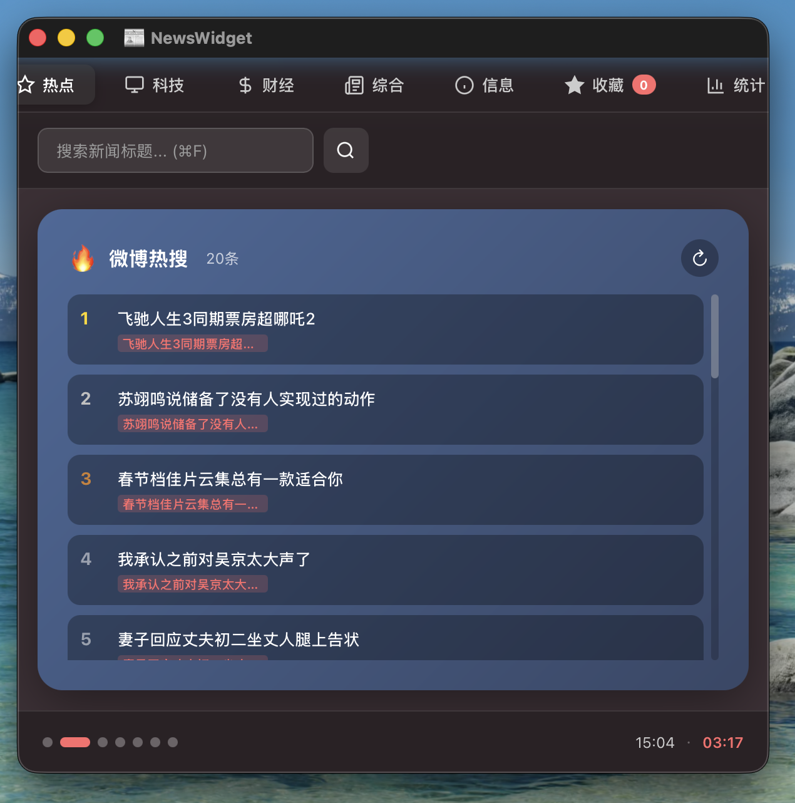
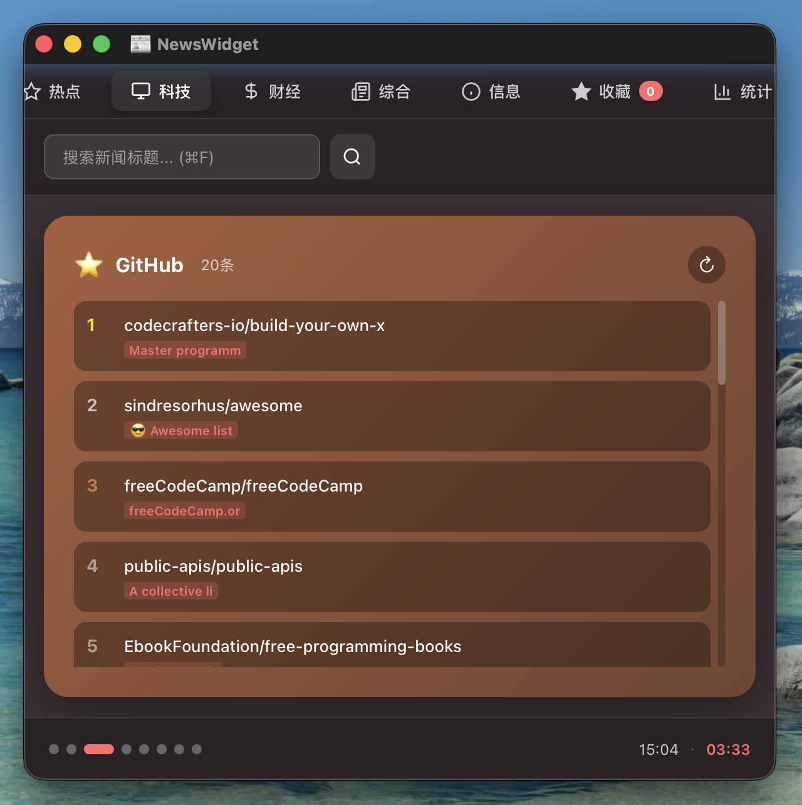
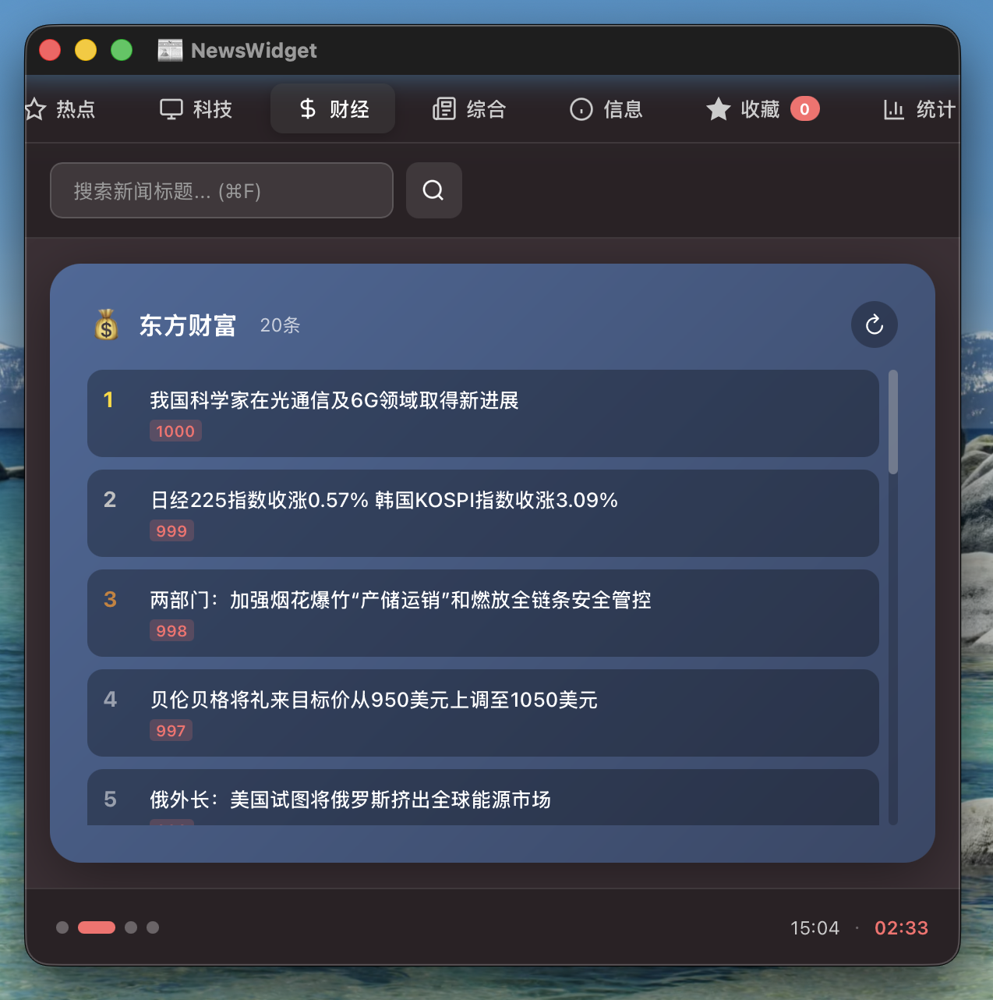
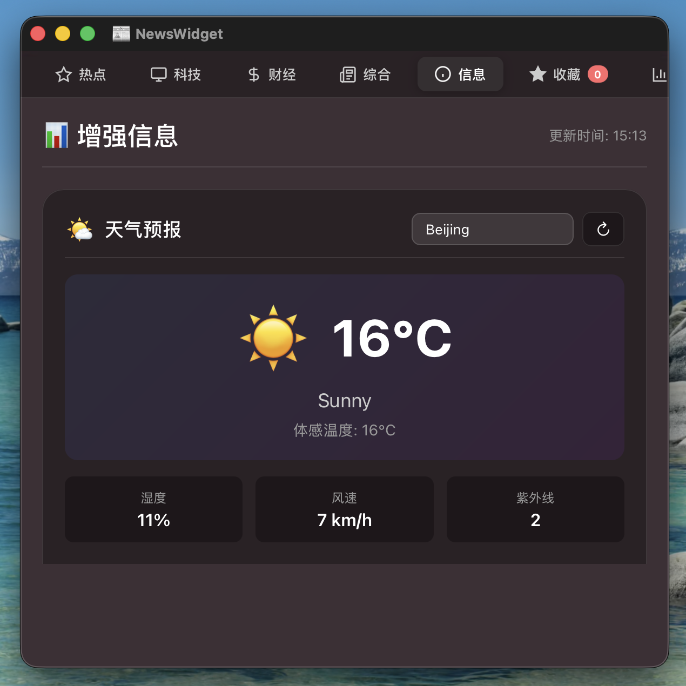
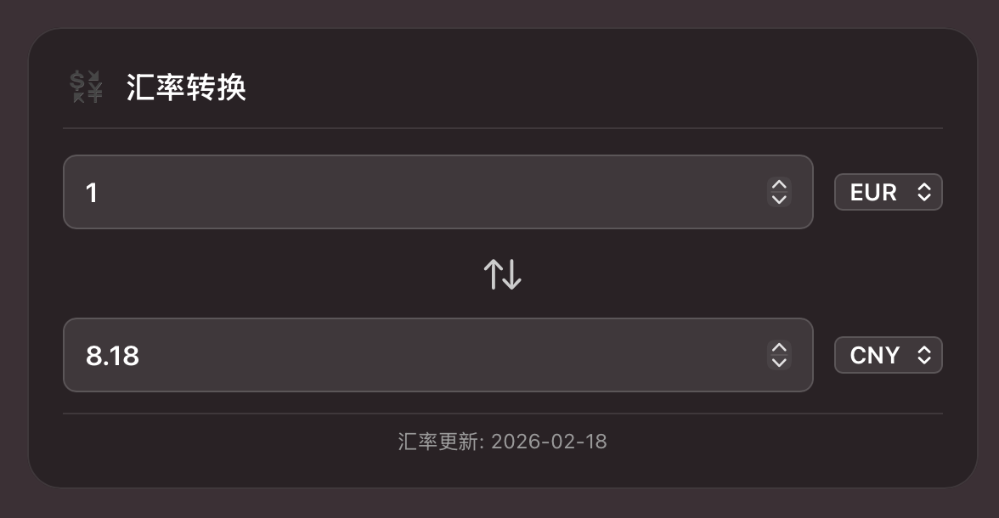
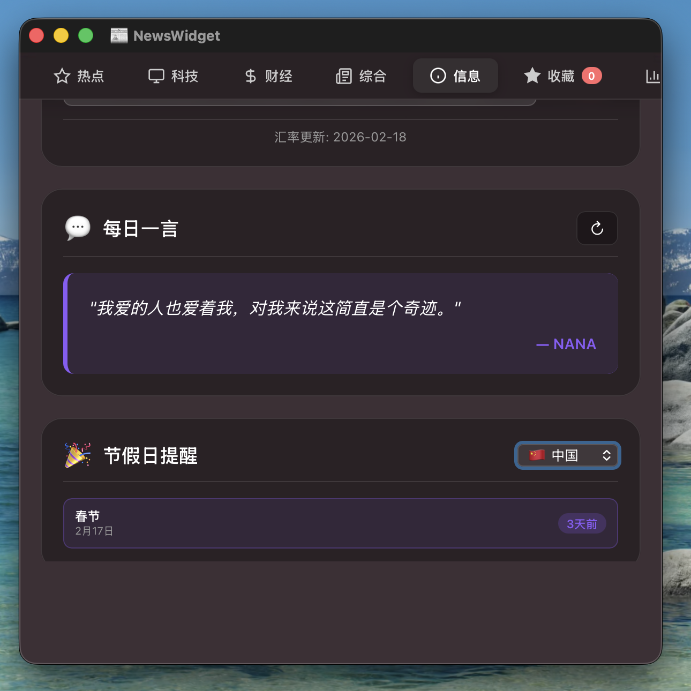
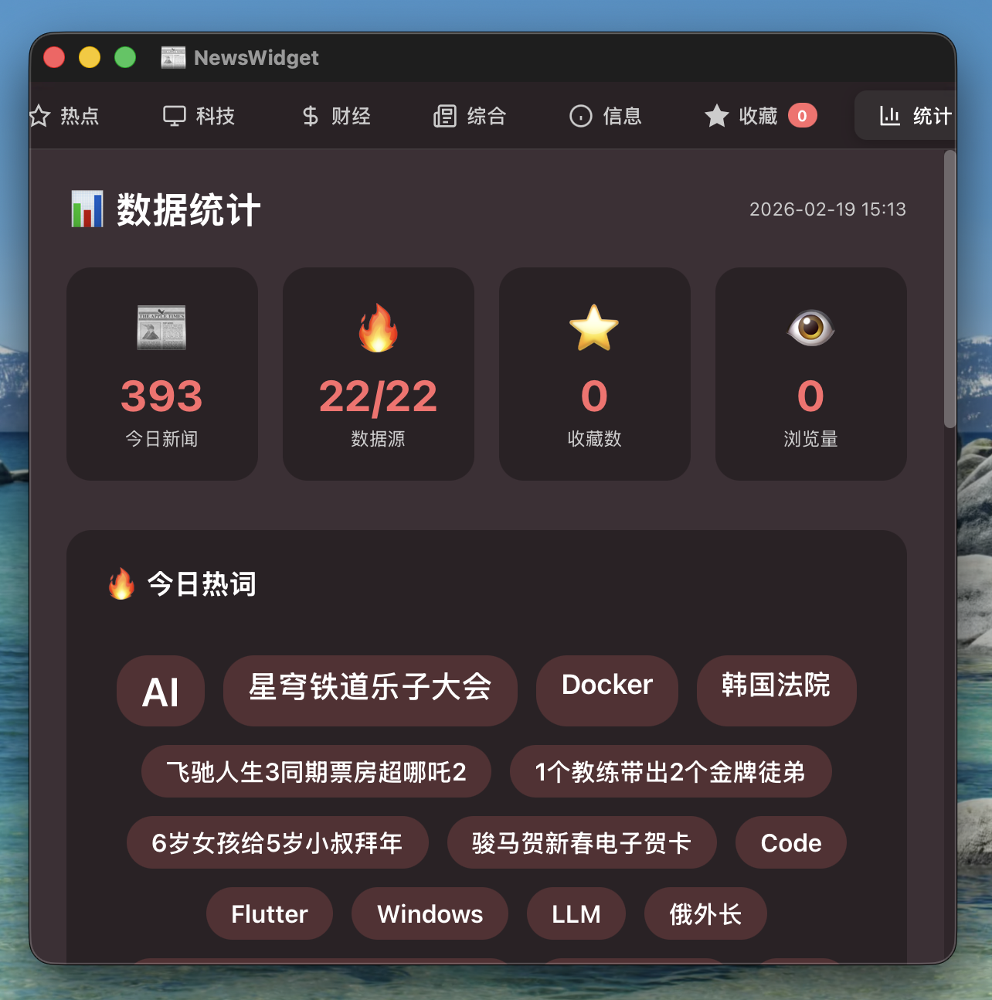
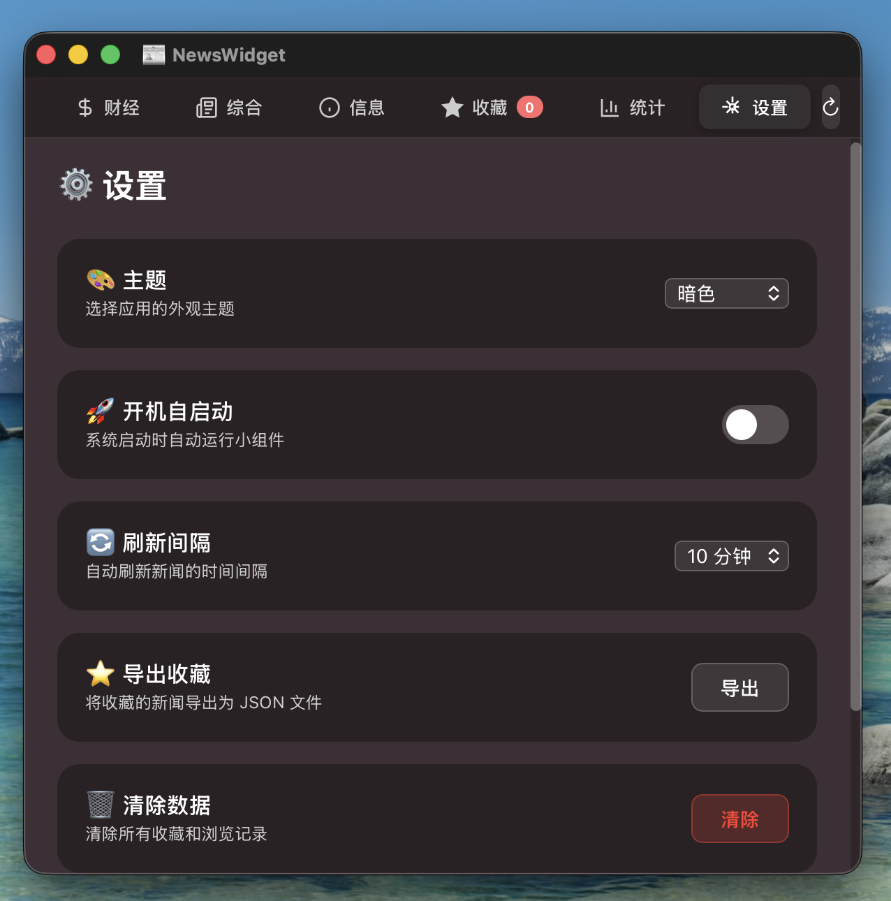

# 📰 NewsWidget

<div align="center">


**🖥️ 一个精美的 macOS 桌面小组件，聚合 22+ 新闻源**

**可自由拖动、调整大小，装饰桌面的同时保持高实用性**

[Features](#-features) • [Installation](#-installation) • [Usage](#-usage) • [Development](#-development) • [Contributing](#-contributing)

</div>

---

## ✨ Features

### 🖥️ 桌面小组件特性
- **自由拖动**: 可在桌面任意位置放置
- **灵活调整**: 支持自由缩放（320×480 ~ 600×1200）
- **置顶显示**: 可选择置于所有窗口之上
- **桌面装饰**: 毛玻璃效果，与 macOS 完美融合
- **实用性强**: 实时新闻、天气、汇率等信息一目了然
- **菜单栏控制**: 📰 图标快速显示/隐藏

### 📰 News Aggregation
- **22 News Sources** from China's top platforms
- **400+ News Items** updated in real-time
- **4 Categories**: Hot Topics, Tech, Finance, General
- **Smart Caching**: 2-minute cache for optimal performance

### 🎨 Beautiful UI
- **Modern Design**: Glassmorphism effects with macOS style
- **Theme Support**: Dark, Light, and System themes
- **Smooth Animations**: Card hover, loading, and transitions
- **Responsive Layout**: Adjustable window size

### ⭐ Core Features
- **Favorites**: Save and manage your favorite news
- **Search**: Global search with keyword highlighting (⌘F)
- **Statistics**: 
  - News count and source analytics
  - Word cloud visualization
  - Category distribution charts
  - Source activity ranking
- **Enhanced Info** (v11.0):
  - 🌤️ Weather forecast (customizable city, 3-day forecast)
  - 💱 Currency converter (5 currencies)
  - 💬 Daily quotes (Chinese)
  - 🎉 Holiday reminders (8 countries)

### ⚙️ Settings
- **Auto-start**: One-click setup for launch at login
- **Refresh Interval**: 5/10/30/60 minutes
- **Export Favorites**: Save as JSON
- **Data Management**: Clear all data

### 🚀 Performance
- **Fast Loading**: 3-4 seconds for 22 sources
- **Cache Hit**: <0.1 second response
- **Low Resource**: ~100MB RAM, <1% CPU (idle)
- **Modular Architecture**: ES6 modules for maintainability

---

## 📸 Screenshots

<div align="center">

### 主界面 - 微博热搜


### GitHub 热门


### 财经频道


### 信息标签页 - 天气预报


### 信息标签页 - 汇率转换


### 信息标签页 - 每日一言与节假日


### 数据统计


### 设置面板


</div>

---

## 📥 Installation

### Download

Download the latest release from [Releases](https://github.com/YOUR_USERNAME/NewsWidget/releases):

```
NewsWidget-v11.0-macOS.zip (18MB)
```

### Install Steps

1. **Extract the zip file**
   - Double-click `NewsWidget-v11.0-macOS.zip` to extract
   - You'll get a folder with `NewsWidget.app` inside

2. **Move to Applications** (Optional but recommended)
   - Drag `NewsWidget.app` to your `/Applications` folder
   - Or keep it anywhere you like (Desktop, Documents, etc.)

3. **First Launch - Important!**
   
   ⚠️ **macOS will block unsigned apps by default**
   
   **Method 1: Right-click to open (Recommended)**
   - Right-click (or Control+click) on `NewsWidget.app`
   - Select **"Open"** from the menu
   - Click **"Open"** in the dialog that appears
   - The app will launch and remember this choice
   
   **Method 2: Remove quarantine attribute (Advanced)**
   ```bash
   xattr -cr /path/to/NewsWidget.app
   ```
   Then double-click to open normally.
   
   **Method 3: System Preferences**
   - Try to open the app (it will be blocked)
   - Go to **System Preferences** → **Security & Privacy**
   - Click **"Open Anyway"** button
   - Confirm by clicking **"Open"**

4. **Enjoy!**
   - The app will open automatically in your browser
   - Visit: http://localhost:3000
   - A menu bar icon (📰) will appear for quick access

### Troubleshooting

**"NewsWidget is damaged and can't be opened"**
- This is macOS Gatekeeper blocking unsigned apps
- Use Method 1 or Method 2 above to bypass

**Port 3000 already in use**
- Another app is using port 3000
- Quit that app or change NewsWidget's port in settings

**Browser doesn't open automatically**
- Manually open: http://localhost:3000
- Check if the app is running (look for 📰 in menu bar)

---

## 🎯 Usage

### 🖥️ 桌面小组件操作

**窗口控制**
- **拖动**: 点击标题栏拖动到任意位置
- **调整大小**: 拖动窗口边缘或角落调整大小
- **显示/隐藏**: 点击菜单栏 📰 图标，或按 `⌘W`
- **置于顶层**: 菜单栏 → 置于顶层
- **重置位置**: 菜单栏 → 重置位置（恢复到右上角）

**窗口大小预设**
- 小 (320×480) - 紧凑模式
- 中 (420×800) - 默认大小
- 大 (520×1000) - 宽屏模式

**使用场景**
- 📍 放在桌面角落，随时查看新闻
- 📍 放在副屏，工作时浏览资讯
- 📍 调整透明度，作为桌面装饰
- 📍 置顶显示，不被其他窗口遮挡

### Keyboard Shortcuts

| Shortcut | Action |
|----------|--------|
| `⌘R` | Refresh news |
| `⌘F` | Search |
| `⌘W` | Show/Hide window |
| `⌘Q` | Quit |

### News Sources

**Hot Topics (7)**:
- Zhihu, Weibo, Baidu, Bilibili, Douyin, Hupu, Tieba

**Tech (8)**:
- Juejin, V2EX, GitHub, Stack Overflow, Hacker News, Sspai, 36Kr, 52Pojie

**Finance (4)**:
- Sina Finance, East Money, Xueqiu, Cailian

**General (3)**:
- Toutiao, Tencent, Douban

### Enhanced Information (v11.0)

**Info Tab** includes 4 cards:
- 🌤️ **Weather Forecast**: Customizable city, 3-day forecast
- 💱 **Currency Converter**: 5 currencies (EUR, CNY, USD, GBP, JPY)
- 💬 **Daily Quote**: Chinese quotes with refresh button
- 🎉 **Holiday Reminders**: 8 countries, ±30 days range

---

## 🛠️ Development

### Prerequisites

- macOS 10.15+
- Node.js 18+
- Swift 5.0+
- Xcode (for compilation)

### Setup

```bash
# Clone the repository
git clone https://github.com/YOUR_USERNAME/NewsWidget.git
cd NewsWidget

# Install dependencies
npm install

# Start the server
node server.js

# In another terminal, run the Swift app
swift run
```

### Project Structure

```
NewsWidget/
├── renderer/                 # Frontend (Web)
│   ├── index-v10.html       # Main HTML (ES6 modules)
│   ├── app-v10.js           # Main app logic (293 lines)
│   ├── style-v9.css         # Styles
│   └── modules/             # ES6 modules
│       ├── search.js        # Search with debounce
│       ├── favorites.js     # Favorites management
│       ├── stats.js         # Statistics
│       ├── theme.js         # Theme switching
│       ├── settings.js      # Settings panel
│       ├── utils.js         # Utility functions
│       └── enhanced-info.js # Enhanced info (v11)
├── backend/                 # Backend
│   └── fetch-news-v2.js    # News fetching (22 sources)
├── widget-desktop.swift     # Swift desktop app
├── server.js                # Node.js server
└── package-v11.sh          # Build script
```

### Architecture

**Frontend**: HTML + CSS + ES6 Modules  
**Backend**: Node.js + Express + 22 news sources  
**Desktop**: Swift + WebKit  
**Packaging**: pkg (Node.js) + shell script

### Build

```bash
# Package for distribution
./package-v11.sh

# Output: NewsWidget-v11.0-macOS.zip (16MB)
```

---

## 🔧 Configuration

### Add New News Source

Edit `backend/fetch-news-v2.js`:

```javascript
{
  id: 'your-source',
  name: 'Your Source',
  category: 'tech',
  url: 'https://api.example.com/news',
  parser: (data) => {
    // Parse and return news items
    return data.map(item => ({
      title: item.title,
      url: item.url,
      score: item.score
    }));
  }
}
```

### Customize UI

- **Styles**: Edit `renderer/style-v9.css`
- **Layout**: Edit `renderer/index-v10.html`
- **Logic**: Edit `renderer/app-v10.js` or modules

---

## 📊 Performance

| Metric | Value |
|--------|-------|
| First Load | 3-4 seconds |
| Cache Hit | <0.1 second |
| Memory | ~100MB |
| CPU (idle) | <1% |
| App Size | 45MB |
| Distribution | 16MB (zip) |

---

## 🤝 Contributing

Contributions are welcome! Please read our [Contributing Guide](CONTRIBUTING.md) first.

### How to Contribute

1. **Fork** the repository
2. **Create** a feature branch (`git checkout -b feature/amazing-feature`)
3. **Commit** your changes (`git commit -m 'Add amazing feature'`)
4. **Push** to the branch (`git push origin feature/amazing-feature`)
5. **Open** a Pull Request

### Development Guidelines

- Follow the existing code style
- Write clear commit messages
- Add tests for new features
- Update documentation

---

## 📝 Changelog

See [CHANGELOG.md](CHANGELOG.md) for version history.

### Latest (v11.0 - 2026-02-19)

**New Features**:
- 💱 Real-time exchange rates
- 💬 Daily inspirational quotes
- 🎉 Holiday reminders (next 7 days)
- 📊 Scrolling info bar at bottom

**Improvements**:
- Enhanced IP query API (Chinese support)
- University information query
- Better error handling

---

## 🐛 Known Issues

- Window title shows Chinese text (requires Xcode recompilation)
- First run may show security warning (normal for unsigned apps)

---

## 📄 License

This project is licensed under the MIT License - see the [LICENSE](LICENSE) file for details.

---

## 🙏 Acknowledgments

- **[NewsNow](https://github.com/ourongxing/newsnow)**: Inspired by this excellent news aggregation project
- **News APIs**: Thanks to all the free news API providers
- **Icons**: SF Symbols by Apple
- **Inspiration**: macOS native design guidelines

---

## 📮 Contact

- **Issues**: [GitHub Issues](https://github.com/YOUR_USERNAME/NewsWidget/issues)
- **Discussions**: [GitHub Discussions](https://github.com/YOUR_USERNAME/NewsWidget/discussions)

---

## ⭐ Star History

If you find this project useful, please consider giving it a star! ⭐

---

<div align="center">

**Made with ❤️ by OpenClaw AI Assistant**

[⬆ Back to Top](#-newswidget)

</div>
